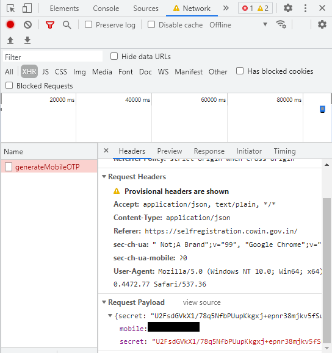
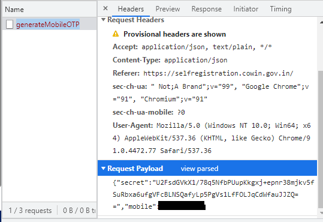

# How to get a New API Key : A Guide

1. Goto [https://selfregistration.cowin.gov.in/](https://selfregistration.cowin.gov.in/) on the browser of your choice

2. Open the Developer Console.

    

3.From the Network Options, select Offline

    

4. Enter your mobile number and click on Get OTP
5. In the network tab you will see an XHR request to **generateMobileOTP**. Click on that and scroll down to Request Payload Section

    

6. Click on View Sources

    

7. The Long String you see after "secret":, and inside the quotations is your new API Key.