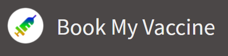
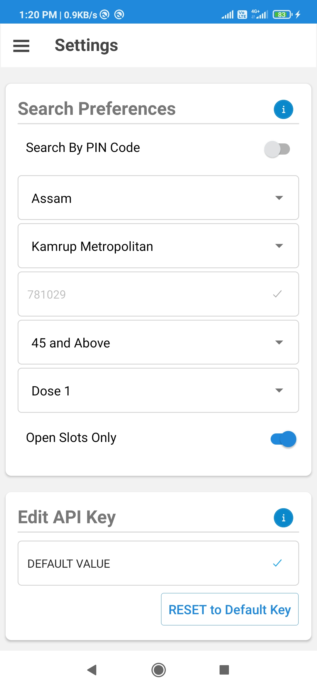
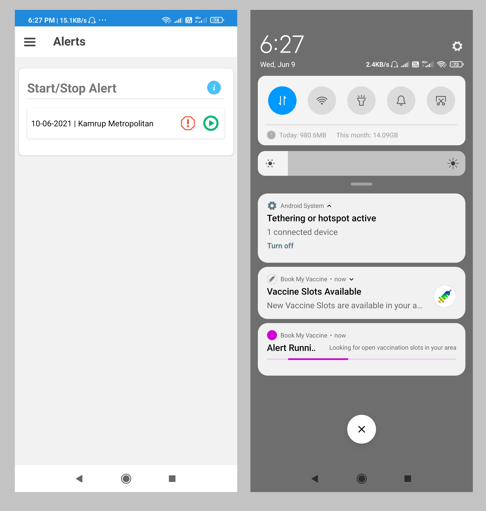
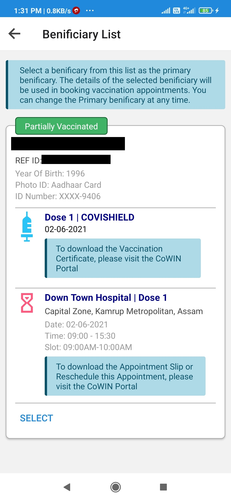
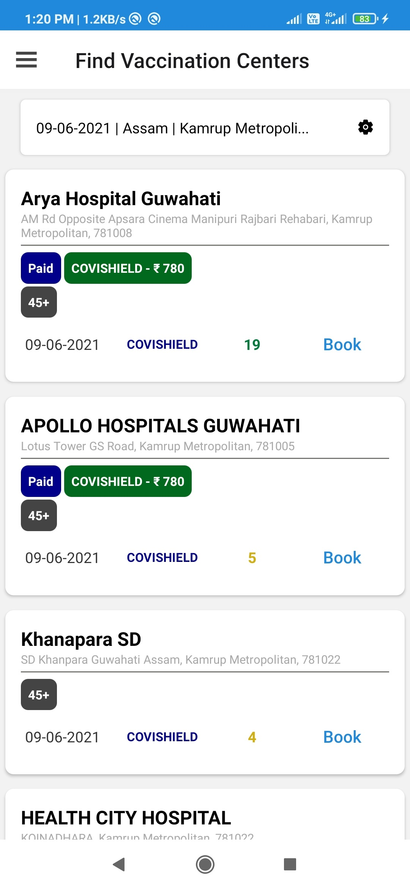
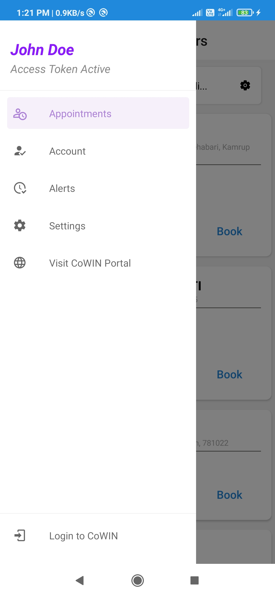

    

# Release

This is the first public release of this app. The app is still in development, and this is just beta release. Expect it to be buggy , and fail sometimes. When you notice bugs, please report them here, so we can work towards making the App better.

# Download The App

You can download the APK by following [This Link](https://github.com/SwapnilB31/BookMyVaccine/raw/main/releasev0.1beta/BookMyVaccine-releasev0.1.1beta.apk)

## Installation Instructions

1. Open the downloaded file
2. You will see a prompt that asks you to 'Allow Installation from Unknown Sources'
3. Toggle the 'Allow From Unknown Sources' switch
4. Return to the previous screen to complete installation 
5. You may also get a popup from 'Play Protect' that says 'Blocked by Play Protect'. In that case press 'Install Anyway' to complete the installation.

# Quick Links
* [How to Get a new API Key](Guide-Getting-New-Api-Key.md)
* [Known Issues](https://github.com/SwapnilB31/BookMyVaccine#known-issues) - check out this section if you have any problems with the app 

# About

Book My Vaccine is an Android App that helps you find out when and where Covid-19 Vaccine Slots become available in your locality. Every other solution that notifies you of vaccine availabilty runs on remote servers, and when the number of recipients to notify grow to a very large size, understandably there may be delays. And when everyone is trying to book the limited slots available, every second matters. With Book My Vaccine, all the processes run on your phone, and when slots become available you get a notification rightaway. 

# Creating Alerts
To get notfied of available slots you need to create an Alert. But before you create an alert you have to specify your Search Preferences in Settings

    

Search Preferences determine the results you see when you search for Vaccination Centers or Create an Alert. Here's a brief summary of what each setting does.

* Search by PIN Code : When Enabled, search results include vaccination centers in the area covered by the PIN Code you enter in the Settings. When Disabled, the search results cover your entire district

* District : The District you want to be notified about. This works in tandem with the first setting. You can get a list of districts in a state by selecting the state from the dropdown above this one

* PIN Code : The PIN Code you want to be notified about. Before creating an alert for your PIN Code, check whether there are any Centers in that PIN Code. It is possible that all PIN Codes in a district may not have vaccination centers. You can search for vaccine centers in the Appointments Screen of this app.

* Age Group : The age group you belong to. This setting filters out all the sessions that you are not eligible for. If you don't specify your age group, search results will include sessions for all age groups (18-44 and 45 and Above).

* Dose: This setting is only used in alerts. The search results on Appointment Screen aren't effected by this. This the dose of the vaccine you are supposed to take. This setting filters out sessions where that particular dose isn't available.

* Open Slots Only: When this setting is enabled only sessions with available slots are displayed. This setting only affects the search results in the Appointmnet Screen only. Alerts only look for sessions with available slots. 

Once you have specified either your district or PIN Code, you can go to the Alerts Screen of this app and start running an alert.

    

Alert runs a background process that queries the CoWIN public API periodically (every 20 seconds). It queries the `calenderByDistrict` or `calenderByPin` end-points of the API. These routes respond with a list of vaccination centers that have sessions upto one week from the date of query. This means that when you see a date of 10-06-2021 on the alert, it is looking for available slots from 10-06-2021 to 16-06-2021.

When your alert is running you will see a notification with a progress bar that says 'Alert Running'. When new vaccine slots become available, you'll get a separate notification.

An alert looks for slots for the current date from 12:00 AM to 10:00 AM. After that it starts looking for slots for the next date.

**Important**: Do not clear all recent apps from the multitasking tab in your phone. If you do that all background apps will be closed and your alert service will also be shut down by the Operating System. Instead remove individual apps, one by one and let 'Book My Vaccine' run in the background.

# Advanced Features
Advanced Features include:

1. Auto Sign In (The application reads the OTP from SMS and signs you in automatically)
2. Set Primary Benificiary: Get a list of benificiaries from the CoWIN portal and select a benificiary for appointmnet booking
3. Appointment Booking: Book appointments inside the app. Saves you the hassle of Signing in with OTP
4. Account Management: Change the primary benificiary any time. You can also login with a different mobile Number

## Benificiary List
Here you can see your appointments and vaccination details

    

## Appointment Booking:

    

## Find Vaccination Centers
You can pull down to refresh the search results

    

## Drawer

    

# About Access Tokens 
Logging in to the App with a Benificiary Reference Id is not the same as logging into the CoWIN API. To identify a user, the API issues access tokens. These access tokens are used to establish your credentials with the server and are needed to perfrom secure tasks like getting benificiary details or scheduling vaccination appointments.

An access token issued by the API is active for 15 minutes, and it expires after that. You can check the status of your access token by opening the Drawer and your token status will be displayed under you name. 

When your access token is expired, the app requests a new token when you perform a secure task. This is all handled by the app and doesn't require user intervention. Before entering a session, you can force a login by pressing on the 'Login to CoWIN' button at the bottom of the navigation drawer, to force a login to avoid a login related delay when performing time sensitive tasks such as scheduling an appointment.

# Known Issues

1. **(patched [2021-06-09 22:37]: Now asks for SMS Read Permissions at App Startup)** In your first login attempt, while you grant the 'Read SMS' permission to the app, the sign in may fail.
In that case you should wait for at least 5 minutes, after granting the permissions, before you try to login again. Alternatively, you can  avoid this problem, by going to your **Phone Settings > App > Book My Vaccine > Permissions** and granting SMS permissions before you try to login. We are aware of this issue and are working on a patch right now.

# Privacy Policy

We do not collect any user data. All the network requests are to and from the CoWIN API and we do not store or share any data. All the data is created by the user and stays on the device.

# Compatibilty

The App is compatible with Android versions 9, 10 and 11. Lower android versions haven't been tested for compatibilty but the target platform supports Android 8 as well. You can try it out on your own phone to see if it works.

# Report Bugs/Crashes
You can report bugs by creating a new issue in the issues section of this repository. Before you create an issue please check if any simiar issues have been raised and resolved in the past.

If you choose to raise an issue, make sure you answer these questions:

1. Which Screen were you on when the app crashed or the bug appeared?
2. Did you press any button on the screen before the crash/bug occured? If yes, then which button?
3. What were the values of the settings at the tinme of crash/bug appearance?
4. Were you connected to the Internet at the time? How would you describe the network quality in your area?
5. Was there anything unusual besides the scope of the first four questions that you noticed before the crash?

And then you can add any additional details you want.

Please note that bugs related to the core functionality will be taken up with the highest priority and UI related bugs will be patched later in subsequent releases.

# Technlogies Used

This app was built with React-Native with the help of awesome packages like [react-native-background-actions](https://www.npmjs.com/package/react-native-background-actions), [react-native-background-timer](https://www.npmjs.com/package/react-native-background-timer) and [react-native-elements](https://reactnativeelements.com/)

# Contributions

Currently the App is in development and the source code is up on a private repository. I am looking for contributors to help with development and maintenance of this project. Anyone interested in working on the app can write to me at [swapnilbhattacharjee187@gmail.com](mailto:swapnilbhattacharjee187@gmail.com).

